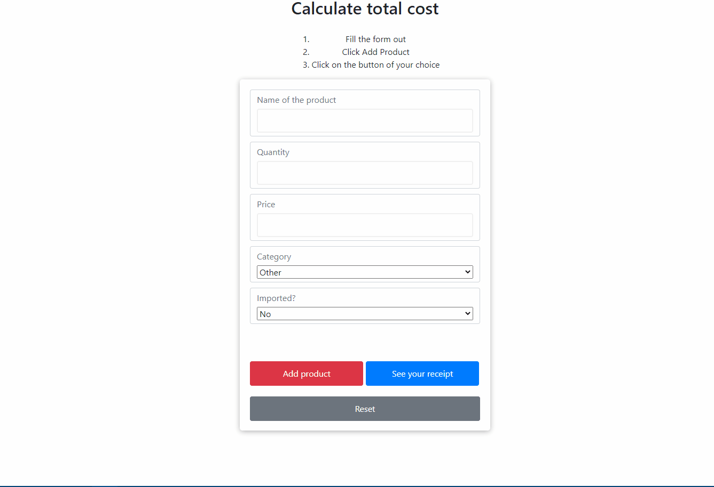

User story.

There are many items available for sale in a store. When Items are purchased, the customer receives a receipt that outlines a total with taxes. Items are taxes in the following way. All not imported  Books, Food, and Medical Items have 0 sales tax. Other Items get 10%sales tax applied to a sales price. All imported items get 5% tax.

We need to build an application that can accurately calculate taxes and totals. In the end, it should show to a customer his recept with all of the items he/she purchased.

Our application.

To get a receipt customers to need to do the following.
1. Fill out a form with the name of the product, quantity, price, choose a product category, and choose if the product was imported or not.
2. Add product to a list
3. Click on the "See you receipt" button
4. View receipt

